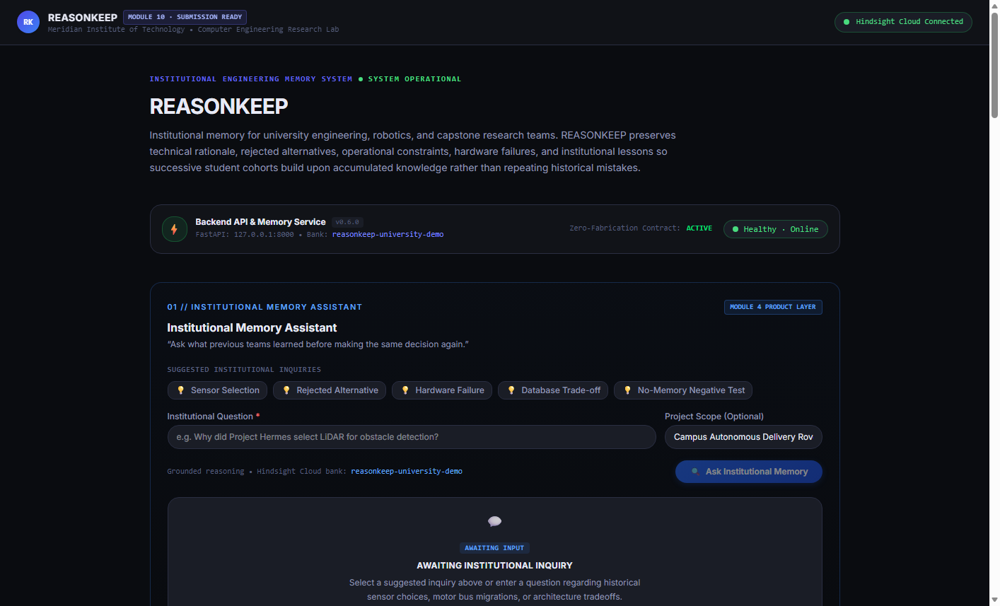
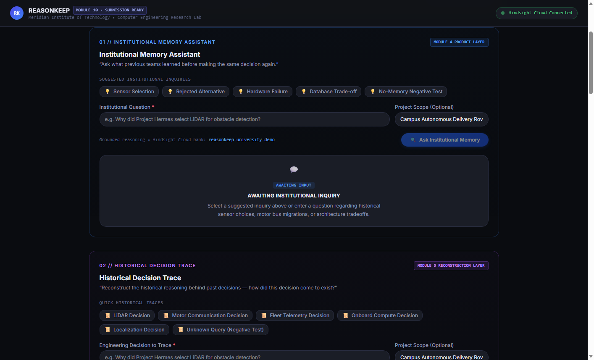
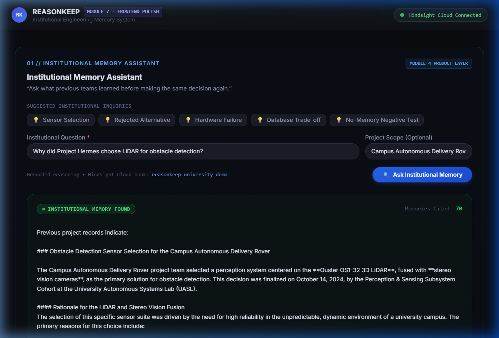
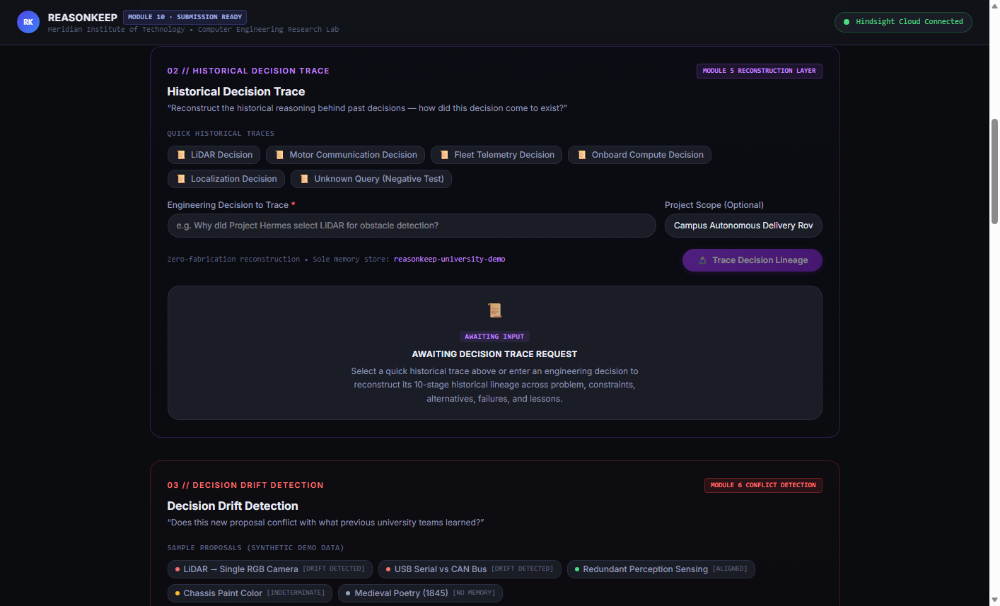
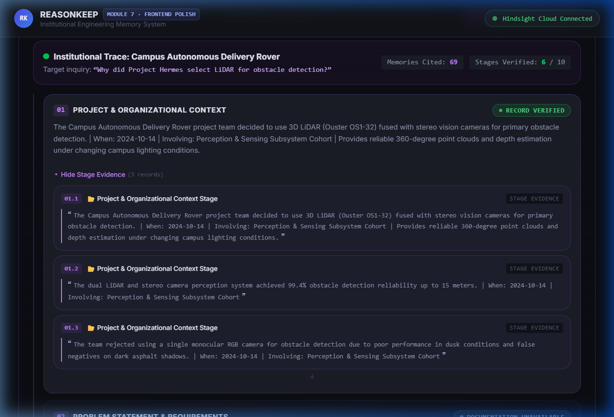
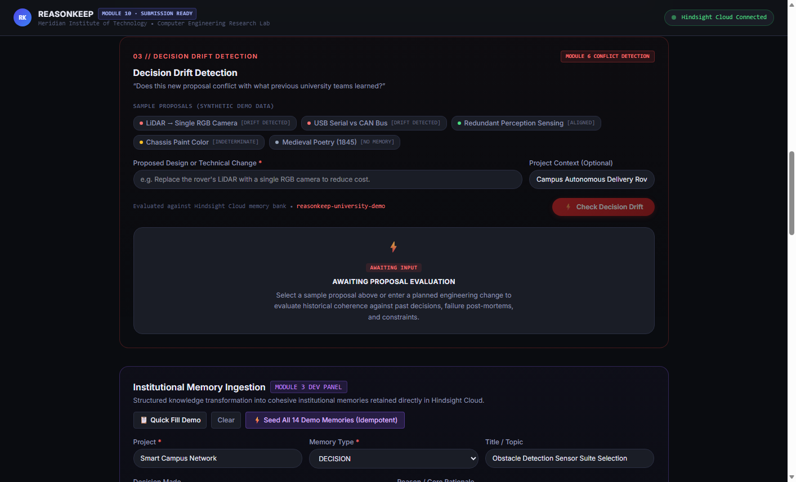
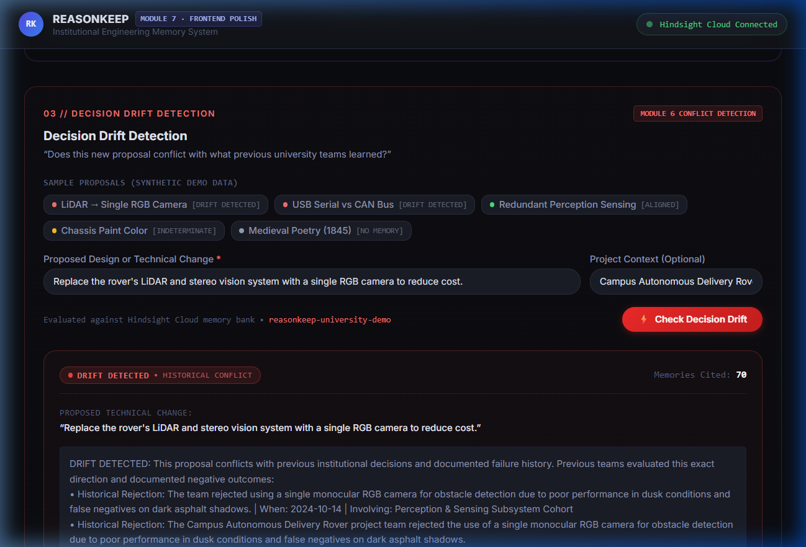
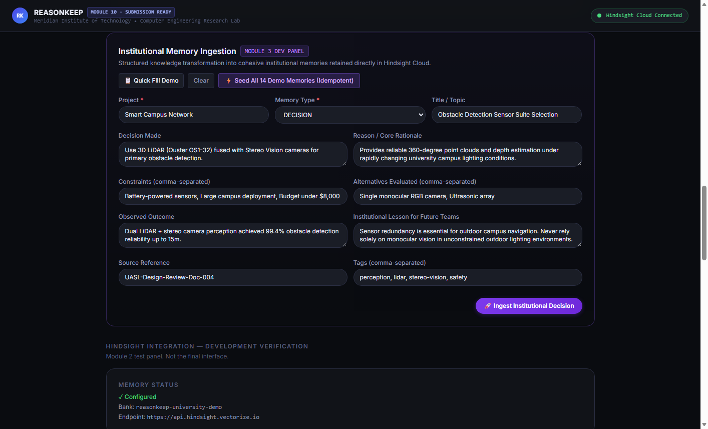
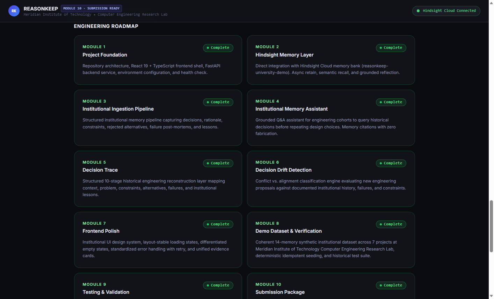

# 🧠 REASONKEEP — Institutional Engineering Memory System

### Institutional Engineering Memory System

<div align="center">


</div>

---

> **REASONKEEP** captures the engineering decisions, rejected alternatives, hardware failures, operational constraints, and institutional lessons that university teams accumulate over years — then makes that knowledge permanently queryable, traceable, and protective against repeating documented mistakes.

---

## 📋 Table of Contents

- [Project Overview](#-project-overview)
- [Problem Statement](#-problem-statement)
- [Proposed Solution](#-proposed-solution)
- [Key Features](#-key-features)
- [System Architecture](#-system-architecture)
- [Technology Stack](#-technology-stack)
- [Core Modules](#-core-modules)
- [Institutional Memory](#-institutional-memory)
- [Retain · Recall · Reflect](#-retain--recall--reflect)
- [Institutional Memory Assistant](#-institutional-memory-assistant)
- [Decision Trace](#-decision-trace)
- [Decision Drift Detection](#-decision-drift-detection)
- [Frontend](#-frontend)
- [Backend](#-backend)
- [API Documentation](#-api-documentation)
- [Project Structure](#-project-structure)
- [Installation](#-installation)
- [Environment Configuration](#-environment-configuration)
- [Running the Project](#-running-the-project)
- [Testing](#-testing)
- [Screenshots](#-screenshots)
- [Security](#-security)
- [Project Roadmap](#-project-roadmap)
- [Future Enhancements](#-future-enhancements)
- [Project Status](#-project-status)
- [Contributors](#-contributors)
- [License](#-license)

---

## 🔬 Project Overview

REASONKEEP is an **institutional engineering memory system** built for university engineering departments, robotics laboratories, and capstone research teams. It preserves structured technical knowledge — decisions, rationale, constraints, rejected alternatives, hardware failures, and inherited lessons — in a permanent cloud memory layer powered by **Hindsight Cloud**.

The system provides three core intelligence surfaces:

- **Institutional Memory Assistant** — Grounded natural-language Q&A over accumulated lab knowledge with verifiable citation badges
- **Historical Decision Trace** — 10-stage chronological reconstruction of past engineering decisions and the reasoning behind them
- **Decision Drift Detection** — Real-time comparison of proposed changes against historical failures and lessons to warn teams before they repeat documented mistakes

REASONKEEP is built around the principle that **memory must be the product, not a hidden feature**. Every answer it provides is grounded in real stored institutional records. When records do not exist, it says so explicitly — it never fabricates.

---

## ⚠️ Problem Statement

University engineering labs and capstone teams face a structural knowledge-loss problem that repeats every academic cycle.

**The Pattern:**

1. A senior team spends a semester investigating communication protocols, evaluating hardware alternatives, and discovering subtle physical failure modes — all through direct experience.
2. They document their decision: *"We chose CAN bus."*
3. They graduate.
4. The next cohort finds the implementation. They see CAN bus. They have no idea why.
5. They propose switching to USB serial. *It fails for the same reason as before.*

The knowledge that was lost was not the decision itself — it was the **reasoning behind it**, the **alternatives that were considered and rejected**, and the **specific failure modes** that shaped the choice.

**What disappears when team members leave:**

- The *reasons* architectural choices were made, not just the choices themselves
- The specific alternatives that were prototyped and the exact ways they failed
- Hardware constraint knowledge: inductive back-EMF, RF shielding attenuation, thermal failures
- Budget, timeline, and compliance constraints that narrowed the option space
- The boundary conditions under which existing decisions are valid and would break

**Why standard documentation fails:**

Static documentation — wikis, README files, slide decks — captures *what* was built but rarely captures *why* it was built that way, *what* was tried first, and *what* constraints ruled out the alternatives. It also goes stale and becomes disconnected from the living codebase.

**The cost:**

Every successive cohort repeating the same experiments, burning the same lab budget, and re-learning the same hard lessons that predecessors already paid for.

---

## 💡 Proposed Solution

REASONKEEP replaces static documentation with a **structured, persistent, queryable institutional memory layer** backed by Hindsight Cloud.

**Structured Ingestion — not freeform writing:**  
Engineering knowledge is ingested as structured records with typed fields: decision, rationale, constraints, alternatives, rejected alternatives with individual explanations, failures, outcomes, and lessons. This structure makes knowledge retrievable by concept, not just keyword.

**Semantic Retrieval:**  
Queries are matched against stored memories using vector similarity, not exact string search. A question about *"wireless sensor failures in industrial environments"* retrieves the chiller plant RF attenuation incident even if those exact words weren't used.

**Grounded Responses — zero fabrication:**  
Every answer the Assistant provides is strictly grounded in retrieved institutional memory. When no relevant records exist, the system returns an explicit empty state. It does not synthesize or speculate.

**10-Stage Decision Reconstruction:**  
The Decision Trace engine reassembles the full engineering lineage of a past decision — context, problem, constraints, alternatives evaluated, alternatives rejected (and why), the decision made, its rationale, failures encountered, observed outcomes, and the lesson inherited by successor teams. Missing stages are declared *DOCUMENTATION UNAVAILABLE*, not invented.

**Conflict Detection Before Damage:**  
The Decision Drift engine compares a proposed new approach against historical institutional memory before any work begins. If the proposal resurrects a previously failed approach, the system surfaces the original failure report with its source record.

---

## ⚡ Key Features

| Feature | Description | Status |
|---|---|:---:|
| **Institutional Memory Assistant** | Grounded natural-language Q&A over stored institutional records with verifiable citation badges (`CIT-01`, `CIT-02`) | ✅ |
| **Historical Decision Trace** | 10-stage chronological reconstruction of past engineering decisions with per-stage evidence cards | ✅ |
| **Decision Drift Detection** | 4-state comparison engine (`drift_detected`, `aligned`, `indeterminate`, `no_memory`) against institutional history | ✅ |
| **Structured Memory Ingestion** | Typed memory records: decision, rationale, constraints, alternatives, rejected alternatives, failures, outcomes, lessons | ✅ |
| **Idempotent Demo Seeder** | 1-click seed of 14 curated institutional records across 7 engineering projects at Meridian Institute of Technology | ✅ |
| **Retain / Recall / Reflect** | Direct developer access to Hindsight Cloud's three core memory primitives with raw response inspection | ✅ |
| **Unified EvidenceCard Component** | Reusable, themed evidence display used consistently across Assistant, Trace, and Drift panels | ✅ |
| **Zero-Fabrication Contract** | All responses grounded in stored memory; explicit empty states when records don't exist | ✅ |
| **Live Backend Health Indicator** | Real-time API connectivity status displayed in the top bar with animated pulse indicator | ✅ |
| **Sanitized Error Boundaries** | Network failures and upstream errors surface clean messages with zero API key or stack trace leakage | ✅ |
| **Automated Test Suite** | 10 Python `unittest` test suites covering all memory operations, error states, and security bounds | ✅ |
| **Restart Persistence Verification** | Stateless backend restart simulation confirming Hindsight Cloud persistence across process cycles | ✅ |
| **Security Audit Suite** | Automated scan of frontend source, `.gitignore`, and `.env.example` for secret leakage | ✅ |

---

## 🏗️ System Architecture

```
┌──────────────────────────────────────────────────────────┐
│                         USER                             │
│          Student · Researcher · Lab Engineer             │
└─────────────────────────┬────────────────────────────────┘
                          │
                          ▼
┌──────────────────────────────────────────────────────────┐
│                PRESENTATION LAYER                        │
│         React 19.2.8 + TypeScript + Vite + Tailwind      │
│                    Port: 5173                            │
│                                                          │
│  ┌─────────────────┐  ┌──────────────────┐              │
│  │ AssistantPanel  │  │ DecisionTrace    │              │
│  │ (Module 4)      │  │ Panel (Module 5) │              │
│  └─────────────────┘  └──────────────────┘              │
│  ┌─────────────────┐  ┌──────────────────┐              │
│  │ DecisionDrift   │  │ IngestionDev     │              │
│  │ Panel (Module 6)│  │ Panel (Module 3) │              │
│  └─────────────────┘  └──────────────────┘              │
│  ┌─────────────────┐  ┌──────────────────┐              │
│  │ MemoryDev       │  │ TopBar + Health  │              │
│  │ Panel (Module 2)│  │ Indicator        │              │
│  └─────────────────┘  └──────────────────┘              │
│                                                          │
│  ┌───────────────────────────────────────────────────┐  │
│  │       EvidenceCard (Unified, Themed)              │  │
│  │  blue=Assistant · purple=Trace · red=Drift        │  │
│  └───────────────────────────────────────────────────┘  │
└─────────────────────────┬────────────────────────────────┘
                          │ HTTP / REST — CORS restricted
                          ▼
┌──────────────────────────────────────────────────────────┐
│               APPLICATION / API LAYER                    │
│     Python 3.11+ · FastAPI 0.115.6 · Pydantic v2         │
│                    Port: 8000                            │
│                                                          │
│  POST /api/assistant/ask     → Assistant Service         │
│  POST /api/trace/decision    → Trace Service             │
│  GET  /api/trace/status      → Trace Service             │
│  POST /api/drift/analyze     → Drift Service             │
│  GET  /api/drift/status      → Drift Service             │
│  POST /api/ingest/decision   → Ingestion Service         │
│  POST /api/ingest/demo-seed  → Demo Dataset              │
│  GET  /api/ingest/demo-data  → Demo Dataset              │
│  POST /api/memory/retain     → Hindsight Client          │
│  POST /api/memory/recall     → Hindsight Client          │
│  POST /api/memory/reflect    → Hindsight Client          │
│  GET  /api/memory/status     → Hindsight Client          │
│  GET  /health                → Core Health               │
└─────────────────────────┬────────────────────────────────┘
                          │ HTTPS / Bearer Token Auth
                          ▼
┌──────────────────────────────────────────────────────────┐
│            INSTITUTIONAL MEMORY LAYER                    │
│          Hindsight Cloud by Vectorize.io                 │
│         api.hindsight.vectorize.io  ·  v0.10.1           │
│                                                          │
│     Memory Bank: "reasonkeep-university-demo"            │
│                                                          │
│  ┌──────────┐  ┌──────────┐  ┌─────────────────────┐   │
│  │  RETAIN  │  │  RECALL  │  │       REFLECT        │   │
│  │  Store   │  │ Retrieve │  │ Grounded Synthesis   │   │
│  └──────────┘  └──────────┘  └─────────────────────┘   │
│                                                          │
│     14 Records · 7 Engineering Projects                  │
│     Meridian Institute of Technology (MIT)               │
└──────────────────────────────────────────────────────────┘
```

**Single Memory Store Architecture:**  
Hindsight Cloud is the *only* persistent store. REASONKEEP deliberately avoids local databases (SQLite, PostgreSQL), secondary vector stores (Chroma, Pinecone, Redis), and LangChain/LangGraph pipelines. One authoritative source of institutional truth.

---

## 🛠️ Technology Stack

### Frontend

| Layer | Technology | Version | Purpose |
|---|---|---|---|
| **UI Framework** | React | `19.2.8` | Component-based declarative interface |
| **Language** | TypeScript | `~6.0.2` | Static type safety across all components and API contracts |
| **Build Tool** | Vite | `^8.3.0` | Fast dev server with hot module replacement |
| **Styling** | Tailwind CSS | `^4.3.3` | Utility-first institutional dark theme |
| **Plugin** | @tailwindcss/vite | `^4.3.3` | Vite-native Tailwind integration |
| **Linter** | oxlint | `^1.81.0` | Fast, opinionated linting |

### Backend

| Layer | Technology | Version | Purpose |
|---|---|---|---|
| **Framework** | FastAPI | `0.115.6` | Asynchronous REST API with automatic OpenAPI schema |
| **Server** | Uvicorn [standard] | `0.32.1` | ASGI production server |
| **Validation** | Pydantic Settings | `2.7.0` | Typed environment variable parsing and schema validation |
| **Env** | python-dotenv | `1.0.1` | `.env` file loading |
| **Memory SDK** | hindsight-client | `0.10.1` | Official Python SDK for Hindsight Cloud operations |
| **Runtime** | Python | `3.11+` | Async-capable runtime |

### Memory Infrastructure

| Component | Identifier | Purpose |
|---|---|---|
| **Memory Platform** | Hindsight Cloud | Managed semantic memory bank with retain / recall / reflect primitives |
| **API Endpoint** | `https://api.hindsight.vectorize.io` | HTTPS cloud gateway |
| **Memory Bank ID** | `reasonkeep-university-demo` | Institutional namespace |
| **Client Version** | `0.10.1` | Python SDK |

### Testing & Tooling

| Tool | Purpose |
|---|---|
| Python `unittest` + `asyncio` | Standard-library test framework for all 10 test suites |
| Chrome DevTools Protocol (CDP) | Automated browser control for screenshot capture |
| Git + GitHub | Version control and repository hosting |

---

## 📦 Core Modules

### Module 1 — Project Foundation
**Status: ✅ Complete**  
React 19 TypeScript frontend shell with Vite build tooling. FastAPI async backend with CORS middleware. Environment configuration via `pydantic-settings`. `useHealthCheck` hook for live API status polling. `TopBar` navigation and `FoundationPage` layout.

### Module 2 — Hindsight Integration
**Status: ✅ Complete**  
Direct connection to Hindsight Cloud (`reasonkeep-university-demo`). Singleton client pattern via `app/hindsight/client.py`. Three core memory primitives exposed via `app/hindsight/service.py`: `retain_memory()`, `recall_memory()`, `reflect_memory()`. Raw developer access through `MemoryDevPanel` with execution latency tracking.

### Module 3 — Institutional Memory Ingestion
**Status: ✅ Complete**  
Typed Pydantic ingestion schema (`InstitutionalMemoryInput`) with fields for project, decision, rationale, constraints, alternatives, rejected alternatives, failures, outcomes, and lessons. Deterministic document ID generation and duplicate prevention. Structured Markdown formatter for Hindsight ingestion (`formatter.py`). `IngestionDevPanel` UI with form validation.

### Module 4 — Institutional Memory Assistant
**Status: ✅ Complete**  
Grounded natural-language Q&A over institutional memory. `AssistantPanel` component with suggested query chips, query input, and response display. Citation badges (`CIT-01`, `CIT-02`) linked to source `EvidenceCard` components. Zero-fabrication: explicit empty state when no records match.

### Module 5 — Historical Decision Trace
**Status: ✅ Complete**  
10-stage historical decision reconstruction engine (`app/trace/service.py`). `DecisionTracePanel` with 6 preloaded quick queries (all scoped to Campus Autonomous Delivery Rover / Project Hermes). Per-stage `EvidenceCard` display with `StatusBadge` variants: `RECORD VERIFIED`, `PARTIAL EVIDENCE`, `DOCUMENTATION UNAVAILABLE`. Explicit unavailable-stage handling — no fabrication.

### Module 6 — Decision Drift Detection
**Status: ✅ Complete**  
4-state drift classifier (`app/drift/service.py`): `drift_detected`, `aligned`, `indeterminate`, `no_memory`. `DecisionDriftPanel` with 5 preloaded demo proposals covering all four drift states. Color-coded `StatusBadge` display. `EvidenceCard` evidence display with `red` theme for conflicts.

### Module 7 — Frontend Polish
**Status: ✅ Complete**  
Institutional dark theme via CSS custom properties (`--color-surface-0/1/2`, `--color-text-primary/secondary/tertiary`, `--color-accent`, `--color-border`). `EmptyState`, `ErrorBanner`, `LoadingState`, `StatusBadge`, and `EvidenceCard` as reusable design-system components. Layout-stable loading skeletons. Differentiated idle vs. not-found empty states.

### Module 8 — Demo Dataset
**Status: ✅ Complete**  
14 curated synthetic institutional records (`app/ingestion/demo_data.py`) across 7 engineering projects at Meridian Institute of Technology. Human-readable mirrors in `demo_data/`. Idempotent 1-click seeder via `POST /api/ingest/demo-seed` with `already_present` / `newly_seeded` tracking.

### Module 9 — Autonomous Institutional Agent
**Status: 🔴 Locked / Out of Scope**  
Autonomous planning, background scheduling, and automated file operations. Deliberately excluded to preserve a deterministic, human-in-the-loop institutional memory architecture.

### Testing & System Validation
**Status: ✅ Complete**  
10 automated Python `unittest` test suites in `backend/tests/`. Master runner `run_all_tests.py`. Coverage: Hindsight connection, retain idempotency, recall archetypes, grounded reflection, 10-stage trace, drift detection (4 states), error boundaries, full API regression, restart persistence, and security audit.

### Submission Package
**Status: ✅ Complete**  
Comprehensive documentation in `docs/`: architecture specification, demo script, video storyboard, project explanation, module reports. 10 high-resolution UI screenshots in `docs/screenshots/`. GitHub-ready `README.md`.

---

## 🧠 Institutional Memory

Institutional memory in REASONKEEP is not freeform text — it is a **structured engineering record** with typed fields that make knowledge retrievable by concept.

**What gets stored:**

```
InstitutionalMemoryInput
├── project           — "Campus Autonomous Delivery Rover"
├── project_type      — "robotics_research"
├── organization_context — "Meridian Institute of Technology — CERL"
├── memory_type       — DECISION | INCIDENT | LESSON | CONSTRAINT
├── title             — "Perception System: LiDAR + Stereo Vision Selection"
├── decision          — The final engineering choice made
├── reason            — Rationale behind the decision
├── constraints       — Budget, physical, timing, regulatory limits
├── alternatives      — Options that were evaluated
├── rejected_alternatives
│   ├── alternative   — Name of rejected option
│   └── reason        — Specific reason it was rejected
├── failures          — Hardware or software failures encountered
├── outcomes          — Observed results in production
└── lessons           — Prescriptive advice for successor teams
```

**The Memory Bank:**  
All records are stored in Hindsight Cloud under the bank identifier `reasonkeep-university-demo`. This is the sole authoritative store — no local database is maintained.

**Demo Dataset (14 Records / 7 Projects):**

| Project ID | Project Name | Key Codified Knowledge |
|---|---|---|
| `MIT-CE-SCN` | Smart Campus Network | PostgreSQL 16 selected over MongoDB; MQTT buffer overflow incident |
| `MIT-CE-RDP` | Research Data Pipeline | Apache Kafka partition key strategy; schema-less JSON streaming failure |
| `MIT-CE-CEM` | Campus Energy Monitoring | Modbus RS-485 selected; Wi-Fi destroyed by 94% RF attenuation in chiller plant |
| `MIT-CE-EAA` | Edge Attendance Analytics | Local SQLite inference selected; SD card write corruption under power-loss |
| `MIT-CE-LEM` | Lab Equipment Monitoring | Dedicated wired Ethernet mandated for -80°C freezers after Wi-Fi alert failure |
| `MIT-CE-ESG` | Environmental Sensor Gateway | 915 MHz LoRaWAN through stone buildings; solar power starvation incident |
| `MIT-CE-ROV` | Campus Delivery Rover (Hermes) | Dual LiDAR + stereo vision; CAN bus selected; motor back-EMF controller freeze |

---

## 🔄 Retain · Recall · Reflect

These are the three fundamental memory operations at the core of REASONKEEP, provided directly by Hindsight Cloud.

```
  ┌──────────┐        ┌──────────┐        ┌──────────────┐
  │  RETAIN  │ ──── ▶ │  RECALL  │ ──── ▶ │   REFLECT    │
  └──────────┘        └──────────┘        └──────────────┘
  Codify & Store      Retrieve Context     Ground & Reason
```

### Retain
**What it does:** Stores a structured engineering record into the Hindsight Cloud memory bank with embedded metadata (project ID, memory type, constraints, alternatives, timestamps).

**When REASONKEEP uses it:** During ingestion via `POST /api/ingest/decision` and `POST /api/ingest/demo-seed`. Also exposed directly via `POST /api/memory/retain` for developer inspection.

**Idempotency:** The ingestion service generates a deterministic document ID from the record's project and title fields. Before retaining, it performs a recall check to detect existing records, preventing duplicate memory accumulation.

### Recall
**What it does:** Searches the memory bank for records semantically relevant to a query. Returns a ranked list of matching memory excerpts with source document IDs and relevance scores.

**When REASONKEEP uses it:** In every query path — the Assistant, Decision Trace, and Drift Detection all start with a recall operation to gather relevant historical context before synthesizing a response.

**Four Query Archetypes (verified in test suite):**
- **Specific component** — *"Why was CAN bus selected for motor controller communication?"*
- **Rejected alternative** — *"Why was USB serial rejected for motor communication?"*
- **Cross-project lesson** — *"What hardware failures involved wireless sensors in industrial environments?"*
- **Unknown query (negative)** — *"University policy on medieval poetry recitation in 1845"* → returns `found: false`

### Reflect
**What it does:** Takes a query and synthesizes a grounded response from retrieved memories. Unlike a plain LLM call, Reflect is anchored to actual stored documents — it will not generate content that is not grounded in a retrieved record.

**When REASONKEEP uses it:** The Assistant `POST /api/assistant/ask` route uses Reflect as its core reasoning engine. The resulting response includes the grounded answer plus a list of `facts` (cited evidence items) that the frontend renders as `EvidenceCard` components.

---

## 🤖 Institutional Memory Assistant

The Institutional Memory Assistant answers engineering questions using accumulated lab knowledge — grounded in real records, never fabricated.

**Interface:**

```
┌─────────────────────────────────────────────────────────┐
│  04. Institutional Memory Assistant                     │
│  Query accumulated institutional engineering memory     │
│─────────────────────────────────────────────────────────│
│                                                         │
│  ┌─────────────────────────────────────────────────┐   │
│  │  Ask about past decisions, failures, lessons... │   │
│  └─────────────────────────────────────────────────┘   │
│                        [ Ask Memory ]                   │
│                                                         │
│  Suggested Queries:                                     │
│  [Why did Hermes use LiDAR?] [CAN bus selection]        │
│  [Chiller plant failure] [LoRaWAN penetration]          │
│                                                         │
│─────────────────────────────────────────────────────────│
│                                                         │
│  GROUNDED RESPONSE                                      │
│  Based on institutional records from Project Hermes...  │
│                                                         │
│  ┌─────────────────────────────────────────┐           │
│  │  CIT-01  📂 Campus Delivery Rover       │           │
│  │  "LiDAR + stereo vision was selected..."│           │
│  └─────────────────────────────────────────┘           │
│                                                         │
└─────────────────────────────────────────────────────────┘
```

**Citation System:**  
Every evidence item returned by Reflect is displayed as a themed `EvidenceCard` (`blue` theme for the Assistant) with:
- Citation badge: `CIT-01`, `CIT-02`, etc.
- Source project context (`📂 Project Name`)
- Record type tag (`DECISION`, `INCIDENT`, etc.)
- Source date if available in the record
- Document ID badge for traceability

**Empty State (Zero-Fabrication):**  
When no institutional records match the query, the panel displays an explicit idle state with the message that no institutional records were found — never a synthesized or speculative response.

---

## 🔍 Decision Trace

The Decision Trace engine reconstructs the **complete engineering lineage** of a past decision through a structured 10-stage timeline — entirely grounded in stored institutional records.

```
01. Context  ──▶  02. Problem  ──▶  03. Constraints  ──▶  04. Alternatives
                                                                  │
10. Lesson  ◀──  09. Outcome  ◀──  08. Failure  ◀──  ...  ◀──  05. Rejected
                                                                  │
                                         06. Decision  ──▶  07. Rationale
```

### The 10 Stages (from `app/trace/service.py`)

| Stage | Key | Purpose |
|---|---|---|
| **01. Context** | `context` | Organizational and project background at the time of the decision |
| **02. Problem** | `problem` | The core engineering challenge that required a decision |
| **03. Constraints** | `constraints` | Budget, physical, timing, regulatory, or environmental bounds |
| **04. Alternatives** | `alternatives` | Viable technical options that were evaluated |
| **05. Rejected Alternatives** | `rejected_alternatives` | Options that were discarded and the documented reasons why |
| **06. Decision** | `decision` | The final engineering architecture or approach selected |
| **07. Rationale** | `rationale` | Technical justification and empirical evidence behind the choice |
| **08. Failure / Roadblock** | `failure` | Hardware or software failures encountered during implementation |
| **09. Outcome** | `outcome` | Observed performance, quantitative results, and validation data |
| **10. Institutional Lesson** | `lesson` | Prescriptive advice distilled for successor engineering teams |

### Quick Trace Queries (preloaded in the UI)

- **LiDAR Decision** — *Why did Project Hermes select LiDAR for obstacle detection?*
- **Motor Communication Decision** — *Motor controller communication failure and migration to CAN bus*
- **Fleet Telemetry Decision** — *Fleet telemetry database selection*
- **Onboard Compute Decision** — *Jetson AGX Orin vs. x86 platform selection*
- **Localization Decision** — *Outdoor localization and RTK-GNSS selection*
- **Negative Test** — *"University policy on medieval poetry recitation in 1845"* (demonstrates zero-fabrication)

### Unavailable Stages
When a stage cannot be grounded in any retrieved institutional record, the panel renders a `DOCUMENTATION UNAVAILABLE` status badge rather than generating synthetic content. This is a hard contract enforced at the service layer.

---

## 🛡️ Decision Drift Detection

Decision Drift Detection prevents teams from unknowingly repeating decisions that previous cohorts already tried, tested, and rejected.

```
New Engineering Proposal (from current team)
               │
               ▼
   Semantic Recall over Memory Bank
               │
               ▼
   Compare Against Historical Records
   (past decisions, rejected alternatives, failure reports)
               │
               ▼
     ┌─────────────────────────────────────────────┐
     │         DRIFT CLASSIFICATION                 │
     ├─────────────┬──────────────┬─────────────────┤
     │  drift_     │   aligned    │  indeterminate  │  no_memory
     │  detected   │              │                 │
     └─────────────┴──────────────┴─────────────────┘
               │
               ▼
   Surface Evidence Cards to Engineer
```

### Drift States

| State | Badge | Meaning |
|---|---|---|
| `drift_detected` | 🔴 **DRIFT DETECTED** | Proposal conflicts with a documented failure or previously rejected alternative |
| `aligned` | 🟢 **ALIGNED** | Proposal reinforces or matches established institutional decisions and lessons |
| `indeterminate` | 🟡 **INDETERMINATE** | Relevant context exists but no clear institutional stance for or against |
| `no_memory` | ⬜ **NO RELEVANT MEMORY** | No institutional records exist for this topic — clean empty state, no speculation |

### Demo Proposals (preloaded in the UI)

| Category | Proposal |
|---|---|
| 🔴 DRIFT DETECTED | Replace LiDAR + stereo vision with a single RGB camera to reduce cost |
| 🔴 DRIFT DETECTED | Use USB serial instead of CAN for motor controller communication |
| 🟢 ALIGNED | Keep redundant perception sensing for campus obstacle detection |
| 🟡 INDETERMINATE | Paint the rover chassis international orange for pedestrian visibility |
| ⬜ NO MEMORY | Adopt a university policy for medieval poetry recitation in 1845 |

**Important:** REASONKEEP surfaces historical evidence to inform engineering decisions. It does not autonomously accept or reject proposals — all final decisions remain with the engineering team.

---

## 🖥️ Frontend

The frontend is a single-page React 19 application with a single page (`FoundationPage`) that renders all engineering intelligence panels vertically.

### Application Structure

**`App.tsx`** — Root component. Mounts `TopBar` and `FoundationPage`, polls backend health via `useHealthCheck` hook.

**`FoundationPage.tsx`** — Primary workspace. Renders all panels in a structured single-column layout with section labels and `aria-labelledby` accessibility attributes.

### Components

| Component | File | Purpose |
|---|---|---|
| **TopBar** | `TopBar.tsx` | Fixed navigation bar with API status indicator, version badge, and bank ID display |
| **AssistantPanel** | `AssistantPanel.tsx` | Module 4: Q&A interface, suggestion chips, grounded response, citation evidence cards |
| **DecisionTracePanel** | `DecisionTracePanel.tsx` | Module 5: 10-stage trace display with stage status badges and per-stage evidence cards |
| **DecisionDriftPanel** | `DecisionDriftPanel.tsx` | Module 6: Drift proposal input, 5 demo proposals, 4-state classification display |
| **IngestionDevPanel** | `IngestionDevPanel.tsx` | Module 3/8: Structured memory ingestion form and 1-click demo seeder |
| **MemoryDevPanel** | `MemoryDevPanel.tsx` | Module 2: Raw retain/recall/reflect controls with response inspection |
| **EvidenceCard** | `EvidenceCard.tsx` | Reusable themed evidence card (blue/purple/red/green/amber/neutral) used across all panels |
| **EmptyState** | `EmptyState.tsx` | Differentiated empty states: idle vs. not-found |
| **ErrorBanner** | `ErrorBanner.tsx` | Standardized error display with retry capability |
| **LoadingState** | `LoadingState.tsx` | Layout-stable loading skeleton |
| **StatusBadge** | `StatusBadge.tsx` | Standardized status labels: RECORD VERIFIED, PARTIAL EVIDENCE, DOCUMENTATION UNAVAILABLE, DRIFT DETECTED, ALIGNED, INDETERMINATE, NO RELEVANT MEMORY |
| **ModuleCard** | `ModuleCard.tsx` | Module roadmap card showing module number, title, status, and description |

### Services

| Service | File | API Calls |
|---|---|---|
| **Base API client** | `api.ts` | `VITE_API_URL` base configuration |
| **Assistant API** | `assistantApi.ts` | `POST /api/assistant/ask` |
| **Trace API** | `traceApi.ts` | `POST /api/trace/decision`, `GET /api/trace/status` |
| **Drift API** | `driftApi.ts` | `POST /api/drift/analyze`, `GET /api/drift/status` |
| **Memory API** | `memoryApi.ts` | `POST /api/memory/retain`, `/recall`, `/reflect`, `GET /status` |
| **Ingestion API** | `ingestionApi.ts` | `POST /api/ingest/decision`, `/demo-seed`, `GET /demo-data` |

### Design System

REASONKEEP uses a CSS custom-property design system defined in `index.css`:

```css
--color-surface-0    /* Page background */
--color-surface-1    /* Card background */
--color-surface-2    /* Nested element background */
--color-text-primary
--color-text-secondary
--color-text-tertiary
--color-accent       /* Indigo highlight */
--color-border
--color-border-dim
```

`EvidenceCard` uses named themes mapped to complete color sets: `blue` (Assistant), `purple` (Trace), `red` (Drift conflicts), `green` (Drift aligned), `amber` (Drift indeterminate), `neutral`.

---

## ⚙️ Backend

The backend is a fully asynchronous FastAPI application (`app/main.py`) with five API routers, a singleton Hindsight client, and domain-specific service modules.

### Application Layout

```
app/
├── main.py               # FastAPI app, CORS middleware, router registration
├── config.py             # Pydantic Settings (env var parsing, singleton)
├── api/
│   ├── assistant.py      # POST /api/assistant/ask
│   ├── drift.py          # POST /api/drift/analyze, GET /api/drift/status
│   ├── health.py         # (health endpoint inline in main.py)
│   ├── ingestion.py      # POST /api/ingest/decision, /demo-seed, GET /demo-data
│   ├── memory.py         # GET /api/memory/status, POST /retain, /recall, /reflect
│   └── trace.py          # POST /api/trace/decision, GET /api/trace/status
├── assistant/
│   ├── schemas.py        # AssistantAskRequest, AssistantAskResponse
│   └── service.py        # query_assistant() — calls reflect_memory()
├── drift/
│   ├── schemas.py        # DriftAnalysisRequest/Response, DriftStatus enum
│   └── service.py        # analyze_decision_drift() — recall + classify
├── hindsight/
│   ├── client.py         # Singleton hindsight_client, is_configured()
│   ├── schemas.py        # RetainRequest/Result, RecallRequest/Result, etc.
│   └── service.py        # retain_memory(), recall_memory(), reflect_memory()
├── ingestion/
│   ├── demo_data.py      # 14 DEMO_MEMORIES across 7 MIT projects
│   ├── formatter.py      # Structured Markdown formatter for Hindsight ingestion
│   ├── schemas.py        # InstitutionalMemoryInput, RejectedAlternative, IngestResult
│   └── service.py        # ingest_institutional_decision() with idempotency check
└── trace/
    ├── schemas.py        # DecisionTraceRequest/Response, StageType, StageStatus
    └── service.py        # assemble_decision_trace() — 10-stage reconstruction
```

### Key Design Decisions

**Singleton Hindsight Client:**  
The Hindsight client is instantiated once per process (`hindsight/client.py`). All services import the singleton rather than creating independent connections. `is_configured()` checks that `HINDSIGHT_API_KEY`, `HINDSIGHT_API_URL`, and `HINDSIGHT_BANK_ID` are all non-empty before allowing operations.

**Pydantic v2 Validation:**  
Every request body is validated against a typed Pydantic model before reaching a service function. Invalid payloads (empty strings, missing required fields) are rejected with structured 422 responses — no unvalidated data reaches the Hindsight client.

**Sanitized Error Boundaries:**  
Each router wraps service calls in `try/except`. Caught exceptions are logged server-side and re-raised as `HTTPException` with generic detail messages. No stack traces, filesystem paths, or environment variable values are included in error responses.

**Idempotent Ingestion:**  
`ingest_institutional_decision()` generates a deterministic `doc_id` from the project and title. When `check_existing=True`, it calls `recall_memory(doc_id)` first. If a match is found, it returns `operation_id="idempotent-cached-{doc_id}"` and `items_count=0` without re-ingesting.

---

## 📡 API Documentation

All 13 REST endpoints verified from source code:

| Method | Endpoint | Description | Auth |
|---|---|---|---|
| `GET` | `/health` | Service status, name (`reasonkeep-api`), and version (`0.6.0`) | None |
| `GET` | `/api/memory/status` | Hindsight configuration: `configured`, `bank_id`, `provider`, `api_url` | None |
| `POST` | `/api/memory/retain` | Store institutional content in Hindsight Cloud bank | Backend env |
| `POST` | `/api/memory/recall` | Semantic recall for a natural-language query | Backend env |
| `POST` | `/api/memory/reflect` | Grounded reflection and synthesis over bank memories | Backend env |
| `POST` | `/api/ingest/decision` | Ingest one structured `InstitutionalMemoryInput` record | Backend env |
| `POST` | `/api/ingest/demo-seed` | Batch-seed all 14 demo records with idempotency tracking | Backend env |
| `GET` | `/api/ingest/demo-data` | Preview the 14 demo records as JSON | None |
| `POST` | `/api/assistant/ask` | Grounded Q&A with memory citations | Backend env |
| `POST` | `/api/trace/decision` | Reconstruct 10-stage historical decision trace | Backend env |
| `GET` | `/api/trace/status` | Trace service configuration readiness | None |
| `POST` | `/api/drift/analyze` | Analyze a proposal for decision drift vs. historical memory | Backend env |
| `GET` | `/api/drift/status` | Drift service configuration readiness | None |

> Interactive API docs available at `http://127.0.0.1:8000/docs` (Swagger UI) and `http://127.0.0.1:8000/redoc` (ReDoc) when the backend is running.

**Example — `POST /api/drift/analyze`**

Request:
```json
{
  "proposal": "Replace the rover's LiDAR system with a single RGB camera to reduce cost.",
  "project": "Campus Autonomous Delivery Rover"
}
```

Response:
```json
{
  "status": "drift_detected",
  "summary": "Historical records indicate a single RGB camera was evaluated and rejected...",
  "warnings": ["Single-camera vision failed obstacle detection under low-light conditions"],
  "evidence": [
    {
      "text": "LiDAR + stereo vision was selected after single RGB camera trials...",
      "context": "Campus Autonomous Delivery Rover",
      "document_id": "MIT-CE-ROV-DEC-001",
      "type": "decision"
    }
  ]
}
```

**Example — `GET /health`**

Response:
```json
{
  "status": "ok",
  "service": "reasonkeep-api",
  "version": "0.6.0"
}
```

---

## 📂 Project Structure

```text
REASONKEEP/
│
├── backend/                          # Python FastAPI Backend
│   ├── app/
│   │   ├── api/                      # REST API Route Controllers
│   │   │   ├── assistant.py          # POST /api/assistant/ask
│   │   │   ├── drift.py              # POST /api/drift/analyze, GET /status
│   │   │   ├── ingestion.py          # POST /api/ingest/decision, demo-seed; GET demo-data
│   │   │   ├── memory.py             # GET /api/memory/status; POST retain, recall, reflect
│   │   │   └── trace.py              # POST /api/trace/decision, GET /status
│   │   ├── assistant/
│   │   │   ├── schemas.py            # AssistantAskRequest, AssistantAskResponse
│   │   │   └── service.py            # query_assistant()
│   │   ├── drift/
│   │   │   ├── schemas.py            # DriftAnalysisRequest/Response, DriftStatus
│   │   │   └── service.py            # analyze_decision_drift()
│   │   ├── hindsight/
│   │   │   ├── client.py             # Singleton Hindsight client, is_configured()
│   │   │   ├── schemas.py            # Memory operation request/response models
│   │   │   └── service.py            # retain_memory(), recall_memory(), reflect_memory()
│   │   ├── ingestion/
│   │   │   ├── demo_data.py          # 14 DEMO_MEMORIES (7 MIT projects)
│   │   │   ├── formatter.py          # Structured Markdown formatter
│   │   │   ├── schemas.py            # InstitutionalMemoryInput, IngestResult
│   │   │   └── service.py            # ingest_institutional_decision() with idempotency
│   │   ├── trace/
│   │   │   ├── schemas.py            # DecisionTraceRequest/Response, StageType, StageStatus
│   │   │   └── service.py            # assemble_decision_trace() — 10-stage reconstruction
│   │   ├── config.py                 # Pydantic Settings singleton
│   │   └── main.py                   # FastAPI app entry, CORS, router registration
│   ├── tests/                        # Automated Test Suite
│   │   ├── run_all_tests.py          # Master test runner (aggregated timing + reporting)
│   │   ├── test_hindsight_connection.py  # TEST 1: Config, health, bank, key isolation
│   │   ├── test_retain.py            # TEST 2: Ingestion and idempotency
│   │   ├── test_recall.py            # TEST 3: 4-archetype semantic recall
│   │   ├── test_reflect.py           # TEST 4: Grounded reflection + Q&A
│   │   ├── test_decision_trace.py    # TEST 5: 10-stage trace + unavailable handling
│   │   ├── test_decision_drift.py    # TEST 6: 4-state drift classification
│   │   ├── test_error_states.py      # TEST 7: Schema validation + error sanitization
│   │   ├── test_regression.py        # TEST 8: Full endpoint regression
│   │   ├── test_restart_persistence.py  # TEST 9: Stateless restart + persistence
│   │   └── test_security_audit.py    # TEST 10: Frontend scan + gitignore + env audit
│   ├── .env.example                  # Environment variable template (safe placeholders)
│   └── requirements.txt              # Backend Python dependencies
│
├── frontend/                         # React 19 + TypeScript Frontend
│   ├── src/
│   │   ├── components/               # Reusable UI components
│   │   │   ├── AssistantPanel.tsx    # Module 4: Memory Q&A interface
│   │   │   ├── DecisionDriftPanel.tsx # Module 6: Drift detection interface
│   │   │   ├── DecisionTracePanel.tsx # Module 5: 10-stage trace interface
│   │   │   ├── EmptyState.tsx        # Idle / not-found differentiated empty states
│   │   │   ├── ErrorBanner.tsx       # Standardized error display
│   │   │   ├── EvidenceCard.tsx      # Unified themed evidence card
│   │   │   ├── IngestionDevPanel.tsx # Module 3/8: Ingestion form + demo seeder
│   │   │   ├── LoadingState.tsx      # Layout-stable loading skeleton
│   │   │   ├── MemoryDevPanel.tsx    # Module 2: Raw memory dev controls
│   │   │   ├── ModuleCard.tsx        # Engineering roadmap module card
│   │   │   ├── StatusBadge.tsx       # Classification status badges
│   │   │   └── TopBar.tsx            # Navigation + live health indicator
│   │   ├── data/
│   │   │   └── index.ts              # MODULES registry + TECH_STACK for roadmap
│   │   ├── hooks/
│   │   │   └── useHealthCheck.ts     # Backend health polling hook
│   │   ├── pages/
│   │   │   └── FoundationPage.tsx    # Primary single-page layout
│   │   ├── services/                 # Typed API client modules
│   │   │   ├── api.ts                # Base API configuration
│   │   │   ├── assistantApi.ts       # Assistant API client
│   │   │   ├── driftApi.ts           # Drift API client
│   │   │   ├── ingestionApi.ts       # Ingestion API client
│   │   │   ├── memoryApi.ts          # Memory API client
│   │   │   └── traceApi.ts           # Trace API client
│   │   ├── types/                    # Shared TypeScript type definitions
│   │   ├── App.tsx                   # Root component
│   │   ├── index.css                 # CSS custom properties design system
│   │   └── main.tsx                  # React DOM entry point
│   ├── package.json
│   └── vite.config.ts
│
├── demo_data/                        # Human-readable demo dataset mirrors
│   ├── decisions/                    # Architectural decision records
│   ├── incidents/                    # Post-mortem failure reports
│   ├── meetings/                     # Design review minutes
│   └── projects/                     # Project background overviews
│
├── docs/                             # Project documentation
│   ├── screenshots/                  # 10 high-resolution UI screenshots
│   │   ├── 01-system-overview.png
│   │   ├── 02-institutional-memory-assistant.png
│   │   ├── 03-memory-found.png
│   │   ├── 04-decision-trace.png
│   │   ├── 05-decision-trace-evidence.png
│   │   ├── 06-decision-drift.png
│   │   ├── 07-historical-conflict.png
│   │   ├── 08-memory-ingestion.png
│   │   ├── 09-hindsight-integration.png
│   │   └── 10-engineering-roadmap.png
│   ├── architecture.md               # Detailed system architecture specification
│   ├── demo-script.md                # Live presentation script
│   ├── demo-video-script.md          # Video walkthrough storyboard
│   ├── module_8_report.md            # Demo dataset implementation report
│   ├── module_9_report.md            # Testing & validation audit report
│   ├── module_10_report.md           # Submission package report
│   └── project-explanation.md       # Comprehensive project explanation
│
├── .env.example                      # Root environment template
├── .gitignore                        # Excludes .env, .venv, node_modules, build artifacts
└── README.md                         # This document
```

---

## 🚀 Installation

### Prerequisites

- **Node.js** `v18.0.0` or higher
- **Python** `3.11` or higher
- **Hindsight Cloud API Key** — free account at [vectorize.io](https://vectorize.io)

### Clone

```bash
git clone https://github.com/AASISH-06/REASONKEEP.git
cd REASONKEEP
```

---

## 🔒 Environment Configuration

All secrets are read exclusively by the backend at startup via `pydantic-settings`. No credentials are embedded in frontend code, committed to source control, or returned in API responses.

Create `backend/.env` from the provided template:

```bash
cp backend/.env.example backend/.env
```

Edit `backend/.env`:

```ini
# ── Core ─────────────────────────────────────────
APP_ENV=development
APP_HOST=127.0.0.1
APP_PORT=8000
FRONTEND_URL=http://localhost:5173

# ── Hindsight Cloud Memory Layer ─────────────────
# Obtain credentials from https://ui.hindsight.vectorize.io
HINDSIGHT_API_URL=https://api.hindsight.vectorize.io
HINDSIGHT_API_KEY=your_hindsight_api_key_here
HINDSIGHT_BANK_ID=reasonkeep-university-demo
```

| Variable | Required | Default | Purpose |
|---|:---:|---|---|
| `HINDSIGHT_API_KEY` | **Yes** | — | Bearer token for Hindsight Cloud authentication |
| `HINDSIGHT_BANK_ID` | No | `reasonkeep-university-demo` | Institutional memory bank namespace |
| `HINDSIGHT_API_URL` | No | `https://api.hindsight.vectorize.io` | Cloud API endpoint |
| `APP_HOST` | No | `127.0.0.1` | Backend bind address |
| `APP_PORT` | No | `8000` | Backend port |
| `FRONTEND_URL` | No | `http://localhost:5173` | CORS allowed origin |

> **Security note:** `HINDSIGHT_API_KEY` is never returned in any API response, log line, or error message. The security audit test suite (`test_security_audit.py`) verifies this automatically.

---

## ▶️ Running the Project

### Backend

```bash
cd backend

# Create virtual environment
python -m venv .venv

# Activate — Windows
.\.venv\Scripts\activate
# Activate — macOS / Linux
source .venv/bin/activate

# Install dependencies
pip install -r requirements.txt

# Start development server
uvicorn app.main:app --reload --host 127.0.0.1 --port 8000
```

- **Health check:** `http://127.0.0.1:8000/health`
- **Swagger UI:** `http://127.0.0.1:8000/docs`
- **ReDoc:** `http://127.0.0.1:8000/redoc`

### Frontend

```bash
cd frontend

# Install dependencies
npm install

# Start development server
npm run dev -- --host 127.0.0.1 --port 5173
```

- **Application:** `http://127.0.0.1:5173`

### Seed Demo Data

With both servers running, click **"Seed Demo Memories"** in the `IngestionDevPanel`, or call directly:

```bash
curl -X POST http://127.0.0.1:8000/api/ingest/demo-seed
```

This idempotently loads all 14 records. Running it multiple times is safe — already-present records are detected and skipped.

---

## 🧪 Testing

REASONKEEP includes 10 automated Python `unittest` test suites in `backend/tests/`.

```bash
cd backend
python tests/run_all_tests.py
```

### Test Suite Results

| Suite | File | Coverage | Result |
|---|---|---|:---:|
| **TEST 1** | `test_hindsight_connection.py` | API health, bank config, key isolation check | ✅ PASS |
| **TEST 2** | `test_retain.py` | Structured ingestion, deterministic doc IDs, duplicate idempotency | ✅ PASS |
| **TEST 3** | `test_recall.py` | 4 query archetypes: specific, rejected alt, cross-project, unknown | ✅ PASS |
| **TEST 4** | `test_reflect.py` | Grounded reflection, evidence extraction, citation links | ✅ PASS |
| **TEST 5** | `test_decision_trace.py` | 10-stage reconstruction, unavailable stage handling | ✅ PASS |
| **TEST 6** | `test_decision_drift.py` | All 4 drift states: conflict, aligned, indeterminate, no_memory | ✅ PASS |
| **TEST 7** | `test_error_states.py` | Pydantic rejections, empty inputs, sanitized error messages | ✅ PASS |
| **TEST 8** | `test_regression.py` | Full endpoint regression across all 13 routes | ✅ PASS |
| **TEST 9** | `test_restart_persistence.py` | Backend restart simulation, cloud memory persistence | ✅ PASS |
| **TEST 10** | `test_security_audit.py` | `.gitignore` audit, `.env.example` scan, frontend source scan | ✅ PASS |
| **TOTAL** | `run_all_tests.py` | All suites | **10 / 10 PASS** |

**The Zero-Fabrication Contract is also tested:**  
TEST 3, TEST 5, and TEST 6 each include a negative query (*"medieval poetry recitation in 1845"*) that verifies the system returns an explicit empty result — never a hallucinated response.

---

## 📸 Screenshots

All screenshots are from the **live running application** connected to the actual Hindsight Cloud memory bank.

### 01 · System Overview
System status dashboard showing live backend connectivity, active memory bank (`reasonkeep-university-demo`), API version (`v0.6.0`), and Zero-Fabrication Contract status.



---

### 02 · Institutional Memory Assistant
Natural-language query interface with suggested query chips and search input for institutional Q&A.



---

### 03 · Grounded Memory Response with Citations
Synthesized institutional answer grounded in real stored records, with interactive `CIT-01` citation badges linking to source `EvidenceCard` components.



---

### 04 · Decision Trace Query Interface
Historical engineering reconstruction panel with 6 preloaded quick-trace scenarios.



---

### 05 · 10-Stage Decision Trace with Evidence
Complete chronological reconstruction across all 10 stages (Context → Lesson) with per-stage status badges and evidence cards.



---

### 06 · Decision Drift Proposal Interface
Drift detection input panel with 5 preloaded demo proposals covering all four classification states.



---

### 07 · Historical Conflict Detected
System warning identifying that the proposed approach conflicts with a documented historical failure — with source evidence cards.



---

### 08 · Structured Memory Ingestion & Demo Seeder
Multi-field ingestion form and 1-click idempotent demo data seeder.



---

### 09 · Direct Hindsight Cloud Operations
Developer panel with raw retain / recall / reflect primitives, execution latency metrics, and connection diagnostics.


---

### 10 · Architecture Specifications & Module Roadmap
Technical specification display and canonical module implementation status.



---

## 🔐 Security

### Key Isolation
`HINDSIGHT_API_KEY` is loaded exclusively from the backend environment via `pydantic-settings`. It is:
- Never included in API response bodies
- Never present in frontend JavaScript bundles
- Never logged in structured log output or error messages
- Never returned from `/health` or `/api/memory/status`

### Repository Cleanliness
`.env` is listed in `.gitignore` and will never be committed. `.env.example` contains only placeholder strings (`your_hindsight_api_key_here`) — verified by `test_security_audit.py`.

### Sanitized Error Responses
All router exception handlers catch errors server-side, log them with Python `logging`, and re-raise sanitized `HTTPException` messages that contain no raw exception details, no file paths, and no environment variable values.

### Automated Security Verification
`test_security_audit.py` automatically verifies:
1. `.gitignore` properly excludes `*.env` patterns
2. `.env.example` contains only placeholder values (not the real key)
3. All `frontend/src/**/*.ts` and `*.tsx` files contain zero references to `HINDSIGHT_API_KEY`
4. Backend `/health` and `/api/memory/status` responses contain no secret values

---

## 🗺️ Project Roadmap

| Module | Scope | Status |
|---|---|:---:|
| **Module 1 — Project Foundation** | React 19 shell, FastAPI backend, CORS, environment configuration | ✅ Complete |
| **Module 2 — Hindsight Integration** | Cloud memory bank binding, retain/recall/reflect primitives, dev panel | ✅ Complete |
| **Module 3 — Memory Ingestion** | Typed ingestion schema, Markdown formatter, idempotent pipeline | ✅ Complete |
| **Module 4 — Memory Assistant** | Grounded Q&A with citation display and zero-fabrication contract | ✅ Complete |
| **Module 5 — Decision Trace** | 10-stage historical reconstruction with unavailable-stage handling | ✅ Complete |
| **Module 6 — Decision Drift** | 4-state drift classifier with conflict evidence surfacing | ✅ Complete |
| **Module 7 — Frontend Polish** | Institutional design system, loading states, unified evidence cards | ✅ Complete |
| **Module 8 — Demo Dataset** | 14 curated records across 7 MIT engineering projects, idempotent seeder | ✅ Complete |
| **Module 9 — Autonomous Agent** | Autonomous planning, background scheduling, automated operations | 🔴 Out of Scope |
| **Testing & Validation** | 10-suite automated test framework (100% pass rate) | ✅ Complete |
| **Submission Package** | Documentation, screenshots, architecture specs, video scripts | ✅ Complete |

---

## 🔮 Future Enhancements

These directions are planned for future research cohorts and are **not** currently implemented:

- **PDF Ingestion Pipeline** — Automated extraction from capstone final reports, thesis PDFs, and lab meeting minutes
- **GitHub Integration** — PR description scanner that checks proposed changes against institutional memory before merge
- **Multi-Lab Memory Partitioning** — Hierarchical bank namespaces supporting cross-lab discovery with departmental privacy controls
- **Hardware BOM Cross-referencing** — Link component part numbers from procurement invoices to failure post-mortems
- **Institutional Knowledge Graph** — Visual graph rendering relationships between projects, shared component families, and decision lineages

---

## 📊 Project Status

```
Modules 1–8:   ✅ COMPLETE & VERIFIED
Module 9:      🔴 LOCKED / OUT OF SCOPE (Autonomous Agent)
Testing:       ✅ 10 / 10 PASS
Submission:    ✅ READY

API Version:   0.6.0
Memory Bank:   reasonkeep-university-demo
Institution:   Meridian Institute of Technology (MIT)
               Computer Engineering Research Lab
```

---

## 👥 Contributors

| Name | Role |
|---|---|
| **Aasish Lebaka** | Lead System Architect & Full-Stack Developer |

---

## 📄 License

This project is submitted as part of an engineering course / hackathon at Meridian Institute of Technology (fictional). License details to be confirmed before public release.

---

## 💬 Support

- **Repository:** [github.com/AASISH-06/REASONKEEP](https://github.com/AASISH-06/REASONKEEP)
- **API Docs (local):** `http://127.0.0.1:8000/docs`
- **Hindsight Cloud:** [vectorize.io](https://vectorize.io)

---

<div align="center">

**REASONKEEP** · Institutional Engineering Memory System  
Meridian Institute of Technology · Computer Engineering Research Lab  
Hindsight Cloud · `reasonkeep-university-demo` · API v0.6.0

*Memory must be the product, not a hidden feature.*

</div>
