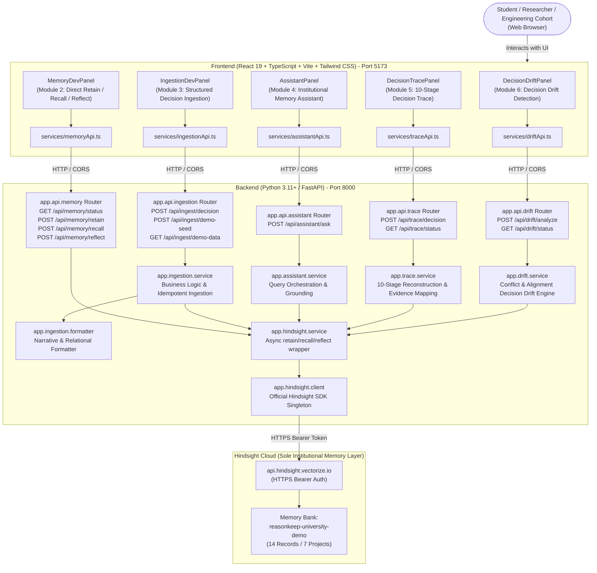

# REASONKEEP — Architecture Overview

> Status: Modules 1–10 COMPLETE & VERIFIED (Module 10: Submission Package)  
> API Version: `0.6.0`  
> Domain: Higher Education — University Engineering, Research, and Technical Project Teams  
> Institution: Meridian Institute of Technology (MIT) — Computer Engineering Research Lab  
> Memory Bank: `reasonkeep-university-demo` (Hindsight Cloud)  

---

## 1. Complete System Diagram



---

## 2. Decision Drift Detection Flow (Module 6)

The Decision Drift layer answers the critical engineering continuity question:  
**"Does this new proposal conflict with what previous university teams learned?"**

```
NEW PROPOSAL SUBMITTED (e.g. "Replace LiDAR and stereo vision with single RGB camera to reduce cost")
      ↓
RECALL MEMORIES (Retrieve historical decision, failure, alternative, and lesson records)
      ↓
REFLECT OVER PROPOSAL (Synthesize grounded factual analysis from Hindsight Cloud bank: reasonkeep-university-demo)
      ↓
DECISION DRIFT CLASSIFICATION ENGINE:
  1. Conflict Scanning:
     - Detects resurrection of previously rejected alternatives (e.g. monocular camera, USB serial).
     - Detects violations of documented institutional lessons (e.g. sensor redundancy requirement, EMI shielding).
     - Detects documented failure conditions triggered by the proposed change.
     → If matches found: status = "drift_detected"
  2. Alignment Scanning:
     - Confirms reinforcement of established architecture decisions or codified lessons.
     → If matches found and no conflicts: status = "aligned"
  3. Indeterminate / Unrelated:
     - If memory bank has general domain context but no specific stance: status = "indeterminate"
     - If query is completely ungrounded or absent: status = "no_memory"
      ↓
ZERO-FABRICATION CONTRACT:
  - If status == "no_memory", documented_conflicts = [], explanation clearly states absence of records.
  - Zero synthesized historical failures, rejected alternatives, or constraints.
      ↓
STRUCTURED DRIFT RESPONSE:
  - status: "drift_detected" | "aligned" | "indeterminate" | "no_memory"
  - proposal: verbatim echoing of incoming proposal
  - explanation: institutional analysis grounded in historical records
  - documented_conflicts: exact past failures/rejections that conflict with proposal
  - previous_decision: previous selected design
  - constraints: active technical & environmental bounds
  - lesson_learned: guidance inherited from predecessors
  - memories_used: count of cited memories
  - evidence: cited Hindsight fact records
```

---

## 3. Decision Trace Reconstruction Flow (Module 5)

The Decision Trace layer reconstructs the historical progression behind an engineering decision:  
**"How did this decision come to exist?"**

```
USER TRACE REQUEST (e.g. "Why did Project Hermes select LiDAR for obstacle detection?")
      ↓
RECALL MEMORIES (Recall candidates via Hindsight Cloud bank: reasonkeep-university-demo)
      ↓
REFLECT OVER GROUNDED MEMORIES (Generate grounded facts with cited evidence)
      ↓
ZERO-FABRICATION CHECK:
  - If no institutional memory exists: found=False, trace=[], no fabricated stages
  - If memory exists: found=True, proceed to stage categorization
      ↓
10-STAGE DECISION PROGRESSION MAPPING:
  01. Context                (Project & organizational background)
  02. Problem                (Core requirements & engineering problem)
  03. Constraints            (Physical, safety, budget, latency bounds)
  04. Alternatives           (All viable technical options evaluated)
  05. Rejected Alternatives  (Options discarded + documented failure rationale)
  06. Decision               (Final selected engineering decision)
  07. Rationale              (Technical justification & evidence basis)
  08. Failure / Roadblocks   (Hardware/software failures encountered during testing)
  09. Outcome                (Observed field performance & quantitative results)
  10. Institutional Lesson   (Direct advice inherited by successor teams)
      ↓
UNAVAILABLE STAGE RULE:
  - If evidence does not exist for a stage: status="unavailable"
  - Description: "No documented institutional evidence found for this stage in memory records."
  - Zero speculative fabrication
      ↓
STRUCTURED DECISION TRACE RESPONSE (query, found, trace[10], memories_used, evidence, bank_id)
```

---

## 4. Institutional Memory Assistant Query Flow (Module 4)

The core value proposition of the Module 4 assistant is:  
**"Ask what previous teams learned before making the same decision again."**

```
USER QUESTION (e.g. "Why did Project Hermes choose LiDAR?")
      ↓
ASSISTANT QUERY ORCHESTRATION (Augment query with optional project/team context)
      ↓
RECALL RELEVANT INSTITUTIONAL MEMORY (Call recall_memory from app.hindsight.service)
      ↓
REFLECT OVER RELEVANT MEMORY (Call reflect_memory with include_facts=True)
      ↓
EVALUATE GROUNDING:
  - If memories cited and valid: found=True, answer with institutional phrasing
  - If no memories exist: found=False, clean no-memory statement, zero fabrication
      ↓
ASSEMBLE SUPPORTING EVIDENCE (Extract cited facts and source contexts)
      ↓
CLIENT RESPONSE CONTRACT (query, found, answer, memories_used, evidence, context, bank_id)
```

---

## 5. Ingestion Flow (Module 3)

REASONKEEP is an institutional memory system, not a generic document bucket. It preserves **WHY** engineering decisions were made, the constraints that bound them, and the lessons learned.

```
Client POST /api/ingest/decision
       ↓
Input Validation (Pydantic v2 schemas: reject empty project/substance)
       ↓
Memory Formatter (Constructs structured narrative preserving decision, rationale, constraints, rejected alternatives, outcome, lesson)
       ↓
Metadata Extraction (Attaches project, memory_type, team, date, source, tags)
       ↓
Hindsight Service (Calls async retain_memory — no second client, no bypassing)
       ↓
Hindsight Cloud (Stored in bank: reasonkeep-university-demo)
```

---

## 6. API Endpoints

| Endpoint | Method | Module | Description |
|---|---|---|---|
| `/health` | GET | 1 | Health check and version status (`0.6.0`) |
| `/api/memory/status` | GET | 2 | Connection status and configured bank ID |
| `/api/memory/retain` | POST | 2 | Direct memory retention |
| `/api/memory/recall` | POST | 2 | Direct memory semantic retrieval |
| `/api/memory/reflect` | POST | 2 | Direct memory reflection |
| `/api/ingest/decision` | POST | 3 | Ingest structured institutional memory |
| `/api/ingest/demo-seed` | POST | 3 | 1-click synthetic demo dataset seed |
| `/api/ingest/demo-data` | GET | 3 | Preview synthetic demo dataset |
| `/api/assistant/ask` | POST | 4 | Institutional Memory Assistant inquiry |
| `/api/trace/decision` | POST | 5 | Structured 10-Stage Decision Trace reconstruction |
| `/api/trace/status` | GET | 5 | Safe Decision Trace configuration status |
| `/api/drift/analyze` | POST | 6 | **Decision Drift Analysis: conflict vs. alignment vs. no memory** |
| `/api/drift/status` | GET | 6 | Safe Decision Drift configuration status |

---

## 7. Security & Isolation

- `HINDSIGHT_API_KEY` remains strictly backend-only in `backend/.env`.
- Never exposed in frontend code, client responses, or logs.
- CORS restricted to development origins (`http://localhost:5173` and `http://127.0.0.1:5173`).

---

## 8. Frontend Polish & Institutional Design Architecture (Module 7)

Module 7 standardizes the frontend presentation into a cohesive institutional engineering product:

1. **Institutional Visual Language**:
   - Technical, restrained, professional dark theme.
   - High visual hierarchy: clear section numbering (`01 //`, `02 //`, `03 //`), distinct badges, mono status indicators.
   - Elimination of generic AI chatbot styling in favor of an institutional knowledge repository.

2. **Layout-Stable Loading States**:
   - Specialized institutional phrasing:
     - Assistant: `"Retrieving institutional memory..."`
     - Decision Trace: `"Reconstructing decision history..."`
     - Decision Drift: `"Checking historical conflicts..."`
   - Animated skeleton pulses with fixed container baselines to prevent layout jumping.
   - Form inputs and submit controls disabled during asynchronous queries to prevent duplicate requests.

3. **Differentiated Empty States**:
   - **Idle State**: Clear instructions and suggested inquiries when user has not yet submitted a query.
   - **No Memory State**: Explicit "NO RELEVANT INSTITUTIONAL MEMORY" or "NO DOCUMENTED DECISION TRACE FOUND" banners when Hindsight returns `found = false` or `status = "no_memory"`.
   - Clear distinction between "not searched yet" and "zero documented records".

4. **Standardized Error Handling with Immediate Retry**:
   - Sanitizes raw network or server exceptions into actionable messages without exposing API keys, file paths, or stack traces.
   - Inline retry actions allow users to immediately re-attempt the failed operation.

5. **Unified Evidence Cards**:
   - Standardized `EvidenceCard` component shared across Assistant, Decision Trace, and Decision Drift.
   - Clearly highlights citation identifier (`CIT-0X`), source context, grounded text excerpt, and record classification.
   - Reinforces the principle: *"Memory must be the product, not a hidden feature."*

---

## 9. Demo Dataset & Institutional Archive (Module 8)

Module 8 implements a coherent, synthetic institutional memory dataset for **Meridian Institute of Technology — Computer Engineering Research Lab**:

1. **Institutional Domain & Scope**:
   - **7 Active Projects**:
     - `MIT-CE-SCN`: Smart Campus Network Infrastructure
     - `MIT-CE-RDP`: Distributed Research Data Pipeline
     - `MIT-CE-CEM`: Campus Energy Monitoring System
     - `MIT-CE-EAA`: Edge Attendance & Analytics
     - `MIT-CE-LEM`: Laboratory Equipment Monitoring
     - `MIT-CE-ESG`: Environmental Sensor Gateway
     - `MIT-CE-ROV`: Campus Delivery Rover (Project Hermes)
   - **14 Structured Records**:
     - 8 Architectural Decisions (PostgreSQL, Kafka, LoRaWAN, SQLite Edge, Isolated CAN Bus, etc.)
     - 6 Incident Post-Mortems & Failures (Wi-Fi Power Meter Drops, Buffer Floods, Motor Bus EMI Lockups, Solar Starvation, etc.)

2. **Deterministic Document Identifiers**:
   - Every record carries a persistent document identifier format:
     `MIT-CE-<PROJ>-<TYPE>-<INDEX>` (e.g., `MIT-CE-SCN-DEC-001`, `MIT-CE-CEM-FAIL-001`).
   - Mapped to human-readable source Markdown files in `demo_data/projects/`, `demo_data/decisions/`, and `demo_data/incidents/`.

3. **Idempotent Ingestion Guarantee**:
   - Calling `/api/ingest/demo-seed` checks existing records in Hindsight Cloud before issuing `retain` calls.
   - Prevents duplicate record inflation and preserves stable memory bank statistics across repeated hackathon demonstrations.

---

## 10. Testing & Validation Architecture (Module 9)

Module 9 provides an end-to-end automated testing architecture situated in `backend/tests/`:

```
backend/tests/
├── test_hindsight_connection.py      # TEST 1: Config, bank ID, provider, secret isolation
├── test_retain.py                    # TEST 2: Deterministic retain & idempotent caching
├── test_recall.py                    # TEST 3: Multi-archetype semantic retrieval
├── test_reflect.py                   # TEST 4: Grounded reflection & assistant Q&A
├── test_decision_trace.py            # TEST 5: 10-stage historical lineage & unavailable handling
├── test_decision_drift.py            # TEST 6: Conflict vs. alignment vs. indeterminate vs. no_memory
├── test_error_states.py              # TEST 7: Input validation & sanitized error disclosures
├── test_regression.py                # TEST 8: Full regression across all 8 Module endpoints
├── test_restart_persistence.py       # TEST 9: Stateless backend process restart & persistence
├── test_security_audit.py            # TEST 12: Key isolation, .gitignore, and .env.example audit
└── run_all_tests.py                  # Master Test Runner (10/10 test suites passing)
```

Key Architectural Invariants Enforced by Tests:
1. **Zero-Fabrication Invariant**: When querying topics without documented institutional history, the system strictly returns empty states and `found=False` rather than synthesizing plausible hallucinations.
2. **Secret Isolation Invariant**: `HINDSIGHT_API_KEY` is strictly confined to the backend process environment; zero keys appear in logs, responses, or frontend source bundles.
3. **Stateless API Invariant**: Backend restarts do not compromise memory integrity because Hindsight Cloud (`reasonkeep-university-demo`) is the authoritative remote persistence layer.

---

## 11. Submission Package Architecture (Module 10)

Module 10 formalizes the submission package per Section 21 of the Master Engineering / Project Bible v1.0:

1. **Submission Documentation**: Complete, submission-ready README, architecture diagrams, demo script, and project explanation.
2. **Demo Storyboard**: High-impact 3–5 minute video walkthrough script with exact screen actions and narration.
3. **Hackathon Demo Script**: Step-by-step verified live demo path with real-world scenarios, historical conflicts, and negative controls.
4. **Frozen Production Boundaries**: Strict lock on Modules 1–10; zero unverified features or autonomous agents introduced.


